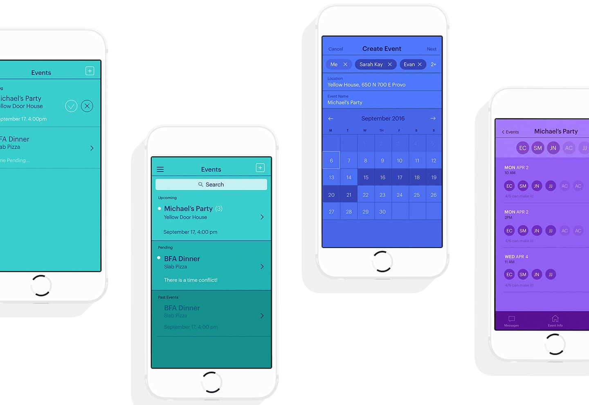
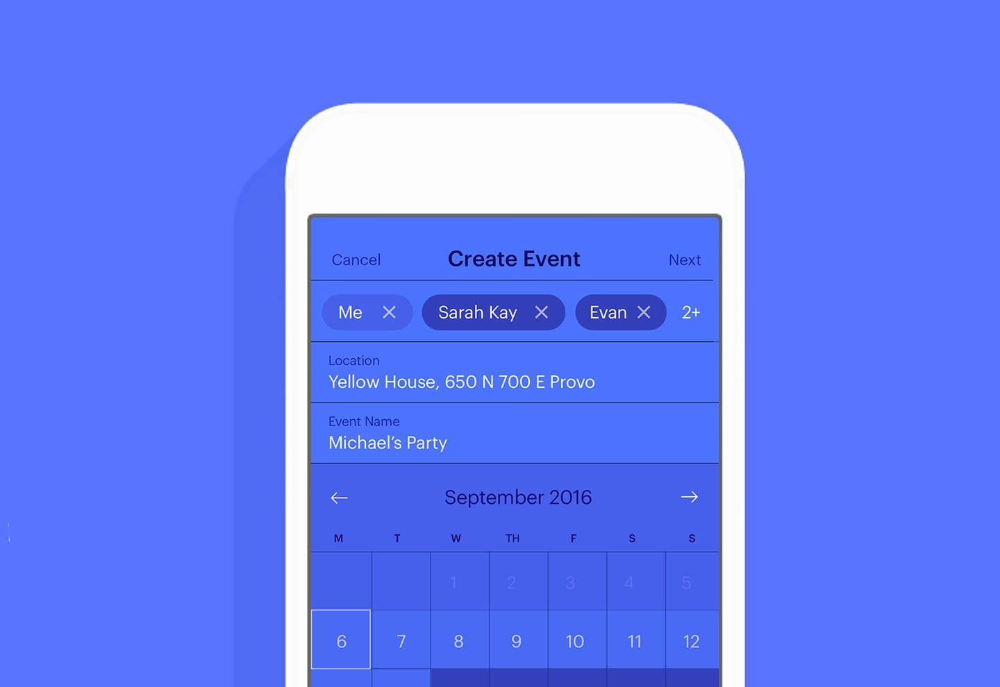
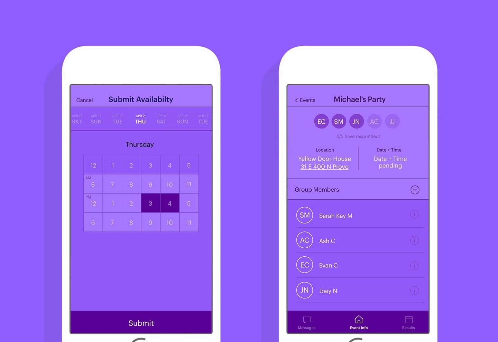
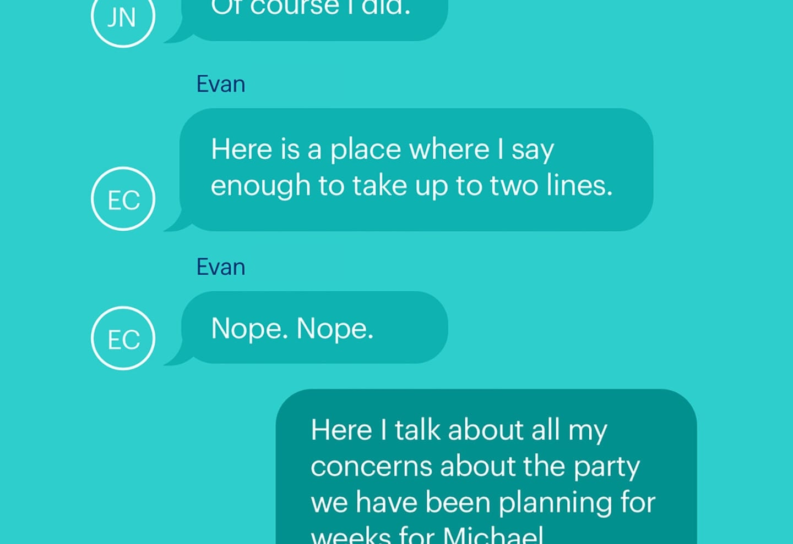

# Windo

This was a project/iOS App concept where we tried to simplify the nightmare
of coordinating schedules - in a way that looked real good. We entered it into
the design portion of a BYU App contest back in 2016 and got 2nd place! How exciting.

In tandem with the design, we were trying to make the app a reality. It wasn't required for the
competition so that probably burnt a lot of our motivation there. Nevertheless, we started and
tried. The important stuff is the design.

The iOS app is originally from [here](https://github.com/joeynelson42/windo). The server is
originally from [here](https://github.com/jdeanwaite/windo-server). I cloned them both into this
repo.

I redid the server for a school project. It was complete enough. I remember it worked completely
for everything I tried but also being terrified that it could probably break pretty easily.

I've included my final write up I did for school, as well as the slide deck I used to present it.

